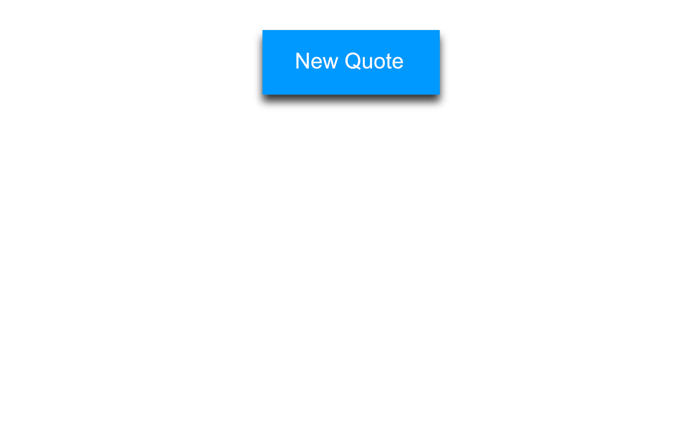
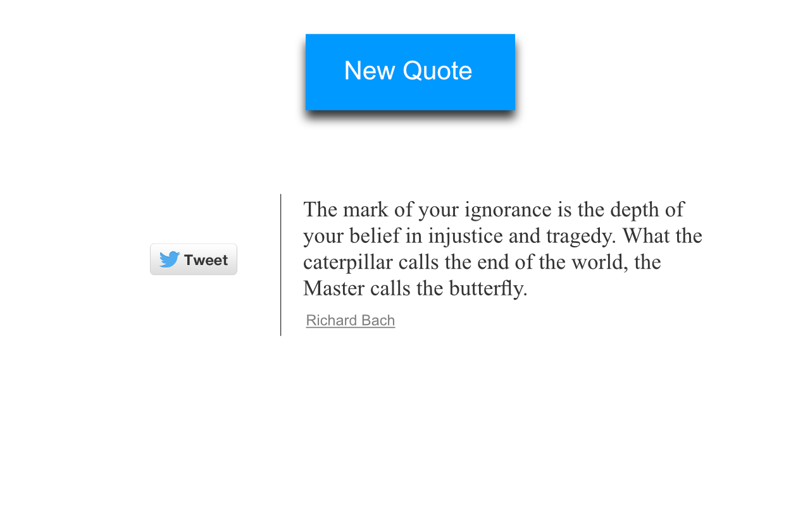
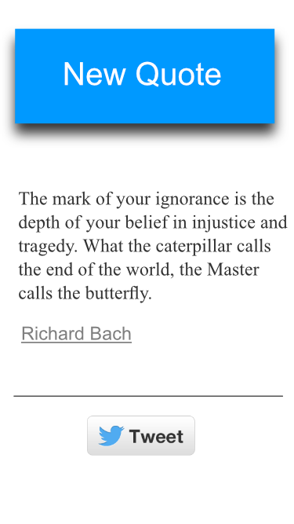

## Random Quote Generator
This is the second front-end project for freecodecamp.com. You have to create a website that allows you to generate random quotes.

## Not yet hosted online

## Tools Used
jQuery, HTML/CSS, Forismatic API to retrieve quotes, Twitter API to tweet

## User Stories
  * User will be able to press a button to get a quote
  * User will be able to tweet the quote

## Wireframes

